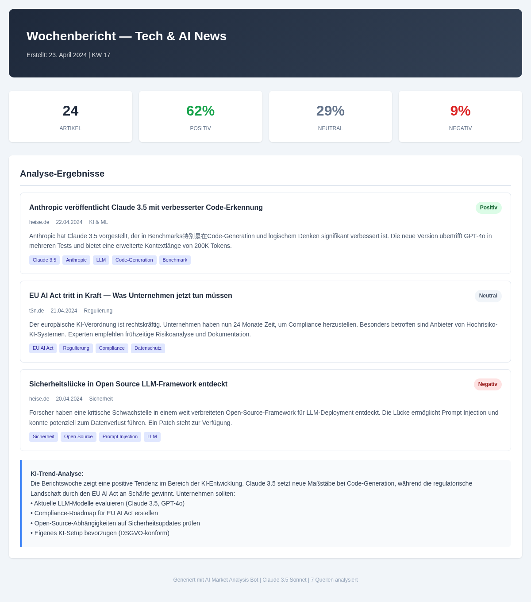

# Ai Market Analysis Bot

<p align="center">

</p>

   

> Automatisierte Marktanalyse und Wettbewerbsbeobachtung mit KI

## Overview

Sammelt und analysiert Marktdaten aus RSS-Feeds und Web-Quellen. Claude AI erstellt strukturierte Wettbewerbsberichte mit Trend-Analyse und Handlungsempfehlungen.

## Features

- RSS-Feed-Monitoring
- Web-Scraping für Marktdaten
- Claude AI Bericht-Generierung
- Konfigurierbare Quellen und Keywords
- Automatische Bericht-Erstellung
- Markdown- und PDF-Export

## Tech Stack

| Tech | Zweck |
|------|-------|
| Python 3.11+ | Backend & Scraping |
| Claude AI | Analyse & Berichte |
| Feedparser | RSS-Verarbeitung |
| Docker | Deployment |

## Quick Start

```bash
pip install -r requirements.txt
python main.py
```

## Screenshots

**Generierter Marktanalyse-Bericht**



---

## Contributing

Beiträge sind willkommen! Bitte erstelle einen Issue oder Pull Request.

## License

MIT License — siehe [LICENSE](LICENSE).

<p align="center">
<a href="https://github.com/ceeceeceecee">ColeTrading</a> &bull; DSGVO-konform &bull; Self-Hosted &bull; Open Source
</p>